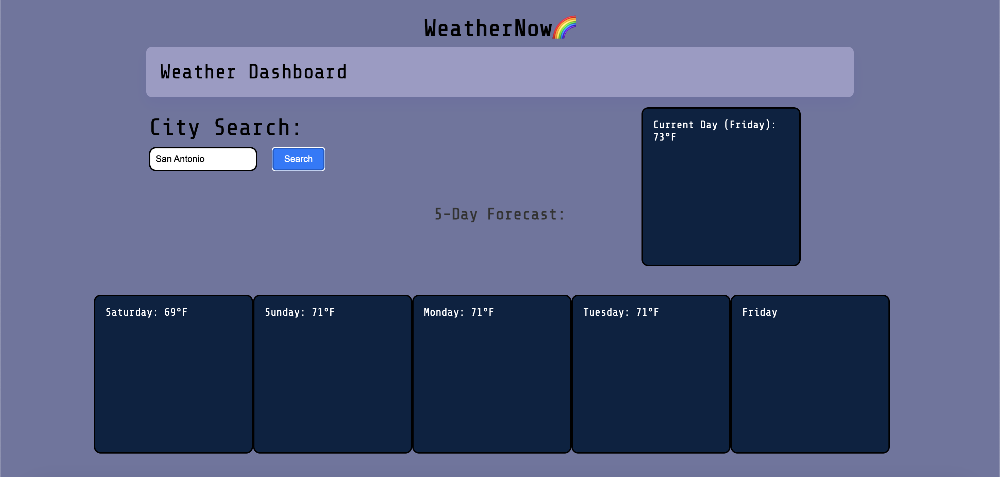

# WeatherNow
WeatherNow is a user friendly website for finding the 5 Day Weather Forecast that features dynamically updated HTML and CSS to always have up to date and daily weather information. 

# Description
WeatherNow is a website that constantly updates the weather 5 day forecast using API's ensuring you always have the latest information at you fingertips. 

# Installation

N/A

# Technology Used

1.- HTML: Creating the structure of the website

2.- CSS: Styling the website by adjusting and giving color to our HTML elements

3.- JavaScript: Making our website to be interactive when users access it.

4.- Google Fonts: adding font-family and font-size from this website to the web application

# API's Used

https://openweathermap.org/forecast5

# Usage

The WeatherNow Webpage displays the 5-Day Weather and current Day forecast for any user in need of knowing weather forecast for travel, work, or general knowledge.

# Links

Repo: https://github.com/Maxxxc1/WeatherNow
Deployed: 

# Screenshot

# Credits: 
Max Chaidez
mdn web docs- code examples
W3schools online- code examples
Third Party Tutor Assistance
Third Party Assistance

# Liscense
MIT License: https://github.com/Maxxxc1/WeatherNow/blob/main/LICENSE